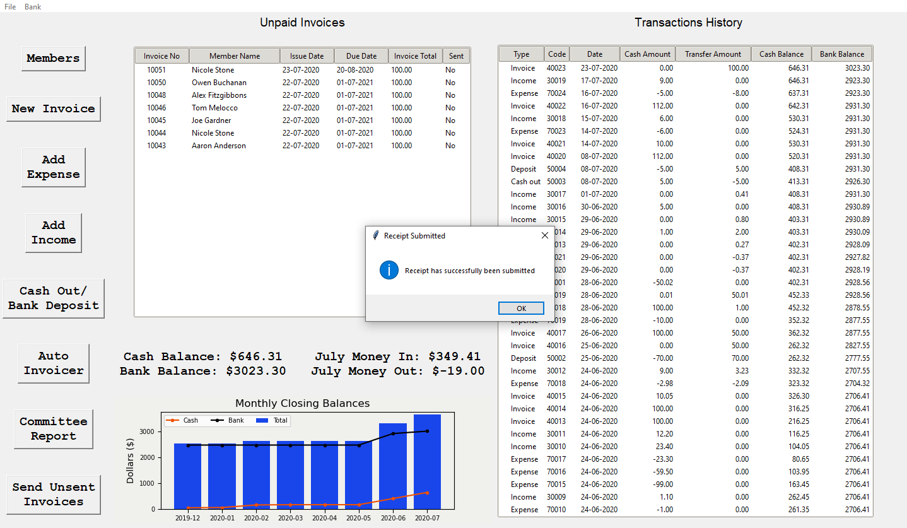

# Monster Truck
## Summary

Monster Truck is a GUI/database interface program designed for a local 4wd club. 
Using tkinter python3 and MySQL, the program handles financial record keeping and 
member details. 

## Features

*	Add/Edit membership details
*	Export member details to excel spreadsheet
*	Issue invoices/receipts
*	Generate invoice/receipt PDFs
*	View transaction history with rolling account balances
*	Easily see unpaid invoices on main menu 
*	View graph of closing balances for all months to see trends 
*	Record club expense and income with custom categories and notes
*	Automatically issue membership renewal invoices
*	Email invoice/receipt PDFs to members through Monster Truck
*	Generate Treasure's report for desired time period

## Contents

- [Main Menu](#main-menu)
- [Members Page](#members-page)
   - [Add New Member](#add-new-member)
   - [Edit Member Details](#edit-member-details)
   - [Export Members information to Excel](#export-members-information-to-excel)
- [Invoices](#invoices)
   - [Issue A New Invoice](#issue-a-new-invoice)
	- [Delete Invoice](#delete-invoice)
- [Transaction History Table](#transaction-history-table)
   - [Invoice Transactions](#invoice-transactions)
      - [Delete Invoice Receipt](#delete-invoice-receipt)
      - [Refund Invoice Receipt](#refunding-invoice-receipt)
      - [Send Invoice Receipt](#send-invoice-receipt)
      - [View Receipt](#view-receipt)
   - [Income Transactions](#income-transactions)
      - [Delete Income Record](#delete-income-record)
   - [Expense Transactions](#expense-transactions)
      - [Delete Expense Record](#delete-expense-record)
   - [Deposit Transactions](#deposit-transactions)
      - [Delete Deposit Record](#delete-deposit-record)
   - [Cash Out Transactions](#cash-out-transactions)
      - [Delete Cash Out Record](#delete-cash-out-record)
   - [Refund Transactions](#refund-transactions)
      - [Send Refund Receipt](#send-refund-receipt)
- [Add Expense](#add-expense)
- [Add Income](#add-income)
- [Cash Withdrawal And Transfers](#cash-withdrawal-and-transfers)
- [Auto-Invoicing](#auto-invoicing)
- [Send Unsent Invoices](#send-unsent-invoices)
        
 

## Main Menu 

The main menu is where we can find the unpaid invoices, transaction history and balance information. It is the first page shown on start up.  If a database connection is established, all the information is shown in the tables and graphs. 

If a connection cannot be made, an error message will show on start-up and all fields will be empty. All features requiring a database connection will result in an error message. 

## Members Page

The members page is where all members details can be viewed and edited. By default, only active members are shown in the members table. To show all members including those inactive, click the ‘Show Inactive Members’ button. To hide inactive members, click again. 

#### Add New Member

To add a new member, click the ‘New Member’ button. A new window will appear which will allow you to enter the new members details. Once details are filled, click submit. The new member’s member no will be automatically set and shown in the ID column. 

#### Edit Member Details

To edit member details, double click the row of the member you want to edit. This will open a window with all the fields prefilled with the members details. To edit the details, simply edit the fields and click submit. 

#### Export Members Information to Excel

To export member information, click the ‘Export Members Info’ button. This will update members_list.xlsx file located in the config folder. This will only export active members information. 

## Invoices

#### Issue A New Invoice

While at the main menu, click the ‘New Invoice’ button. This will open the new invoice window. First select the member in the dropdown menu for which the invoice will apply. To add an item to the invoice, select one from the item dropdown menu. When you select an item, a pre-set price and quantity will auto fill into the respective fields. These can be edited by entering new values. To add the item to the invoice, click the ‘+’ button to the right of the quantity field. This will add the item to the invoice.

To remove an item from the invoice, click the item in the table to highlight it and then click the ‘-‘ button at the top right. 
Once all desired items are added to the invoice, select the due date for the invoice from the calendar dropdown. Once done, click ‘Submit Invoice’.

#### Issue Invoice Receipt

When at the main menu, double click the unpaid invoice you want to issue a receipt for. A window will open with all the information about the invoice. To issue the receipt, click the ‘Issue Receipt’ button. 

A second window will appear allowing you to enter the cash and/or transfer amount paid as well as the payment date. When all the relevant fields are filled, click ‘Submit’ to issue the receipt. The receipt PDF created was saved in the ‘receipt_pdfs’ folder in the config folder. The payment will appear in the transaction history table, in the order of the payment date. All windows will close, and a message box will appear with a message stating the receipt had successfully been submitted. 

Clicking ok to this message will show another message asking if you would like to send the receipt pdf to the members email address. If the email sent successfully, a message box will appear stating so. 

#### Delete Invoice

When at the main menu, double click the unpaid invoice you want to delete. On the invoice information page, click the ‘Delete Invoice’ button. 

Click ‘Yes’ on the message box that appears. This will delete the invoice from the unpaid invoices table. Note that deleting the invoice will act as if it never existed. The next invoice you create will have the same invoice number as the one you just deleted. Also, the PDF of the deleted invoice will still exist in the ‘invoice_pdfs’ folder but will be overwritten when a new invoice is created. 

## Transaction History Table

The transaction history table show all transactions, ordered by payment date (Most recent at top). Each transaction has a type: Invoice; Income; Expense; Cash Out; Deposit; and Refund. To view information on an individual transaction, double click the transaction. A new window will open with the transaction information. 

#### Invoice Transactions

The invoice transaction window shows all the information about the invoice receipt. 

#### Delete Invoice Receipt

To delete an invoice receipt, click the ‘Delete’ button. A message box will appear asking if you are sure you want to delete this receipt. Click ‘Yes’ to delete. Once deleted, you will notice that the recently deleted invoice receipt was removed from the transaction history table. At the same time, a new unpaid invoice was added to the unpaid invoice table. Deleting the invoice receipt acts as if the invoice was never paid. 

Note that you will not be able to delete an invoice receipt if it has already been refunded. See <i>Refunding Invoice Receipt</i>.

#### Refunding Invoice Receipt

To refund an invoice receipt, click the ‘Refund’ button. A new window will appear with radio buttons for ‘Cash Refund’ and ‘Transfer Refund’. Click the type of refund you want to issue and click the ‘Submit’ button. 

A message box asking if you are sure you want to issue the refund. Click ‘Yes’ to refund. 

A message box will appear once the refund has been submitted. A new row has also been added to the Transaction History table. You won’t be able to delete or refund an invoice receipt after it has been refunded. You will get a warning message stating when the refund took place. 

#### Send Invoice Receipt 

To send/resend an invoice receipt to the member, click the 'Send Receipt’ button. If the invoice receipt has been recorded as sent, the button will say ‘Resend Receipt’. 

#### View Receipt

To view the PDF of the current receipt, click the ‘View Receipt’ button. This will open the PDF in the default pdf viewer on your computer (e.g. Adobe Acrobat, Chrome, Firefox)

## Income Transactions

The income transaction window shows all the information about the selected club income record. 

#### Delete Income Record

To delete an income transaction record, click the ‘Delete’ button. You will be prompted with a message box asking if you are sure you want to delete the record. Click ‘Yes’ to delete. 

## Expense Transactions

The expense transaction window shows all the information about the selected club expense record. 

#### Delete Expense Record

To delete an expense transaction record, click the ‘Delete’ button. You will be prompted with a message box asking if you are sure you want to delete the record. Click ‘Yes’ to delete. 

## Deposit Transactions

The deposit transaction window shows all the information about the selected bank deposit record. 

#### Delete Deposit Record

To delete a deposit transaction record, click the ‘Delete’ button. You will be prompted with a message box asking if you are sure you want to delete the record. Click ‘Yes’ to delete. 

## Cash Out Transactions

The cash out transaction window shows all the information about the selected cash out record. 

#### Delete Cash Out Record

To delete a cash out transaction record, click the ‘Delete’ button. You will be prompted with a message box asking if you are sure you want to delete the record. Click ‘Yes’ to delete. 

## Refund Transactions

The refund transaction window shows all the information about the selected refund record. 

#### Send Refund Receipt  

To send/resend a refund receipt to the member, click the 'Send Refund’ button. If the refund receipt has been recorded as sent, the button will say ‘Resend Refund’. 

## Add Expense

To add a club expense, select an expense category from the drop-down menu at the top of the page. If you want to add a new category, select ‘New Category’. An empty field will appear below the drop-down menu. Type into the field the new category you would like to use. Enter the cash and/or transfer amounts into the respective fields. Select the date of the expense from the calendar. Add any notes you wish to apply to the expense record. Click ‘Submit’.

  

## Add Income

To add a club income, select an income category from the drop-down menu at the top of the page. If you want to add a new category, select ‘New Category’. An empty field will appear below the drop-down menu. Type into the field the new category you would like to use. Enter the cash and/or transfer amounts into the respective fields. Select the date of the expense from the calendar. Add any notes you wish to apply to the income record. Click ‘Submit’.

  

#### Cash Withdrawal and Transfers

To record a cash withdrawal or Bank deposit, enter the amount to withdraw/deposit into the centre field. Make sure it is greater than zero otherwise an error message will appear. To deposit the amount, click ‘Deposit’. Likewise, for ‘Cash Out’. If for example you want to record a withdrawal of $10, enter 10 into the field and click ‘Cash Out’. The cash balance will increase by 10 and the bank balance will decrease by 10. A cash out record will also be added to the transaction history table.  

#### Auto-Invoicing

This feature allows you to automatically create annual membership renewal invoices for all active members. After creating all the invoices, you will have the ability to send out all the invoices via email. Set the due date the invoices from the dropdown calendar. By default, it is set to the 1st of July. Set the membership price and then click ‘Start’. You will be prompted with a message to verify you want to proceed. 

  

After all invoices are created, another message will appear asking if you would like to email the newly created invoices to the members. 

  

  

## Send Unsent Invoices

If you have many unsent invoices, use the ‘Send Unsent Invoices’ features to send them out easily. After clicking the ‘Send Unsent Invoices’ button, a message box will appear asking if you are sure to continue.  Click ‘Yes’ to start sending out invoices. After a few moments, a window with a progress bar will appear. It will indicate which invoice is being sent and to what email address. 

  

  

